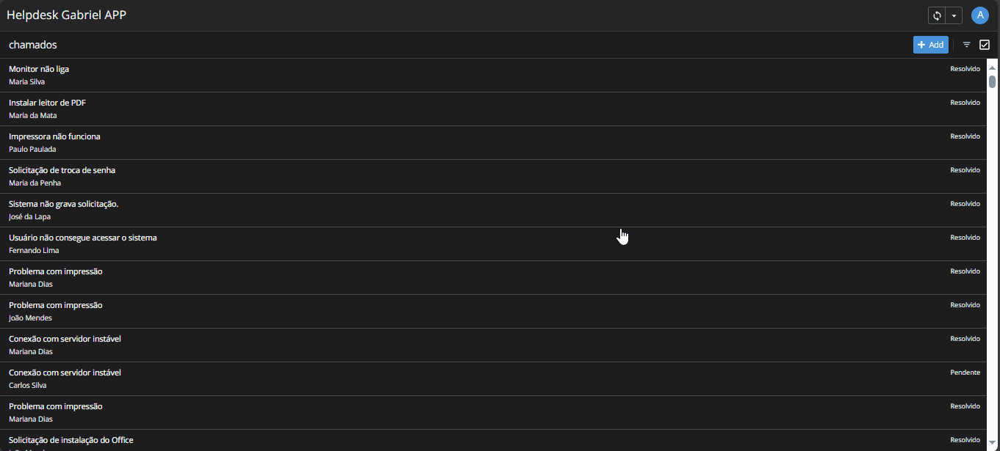
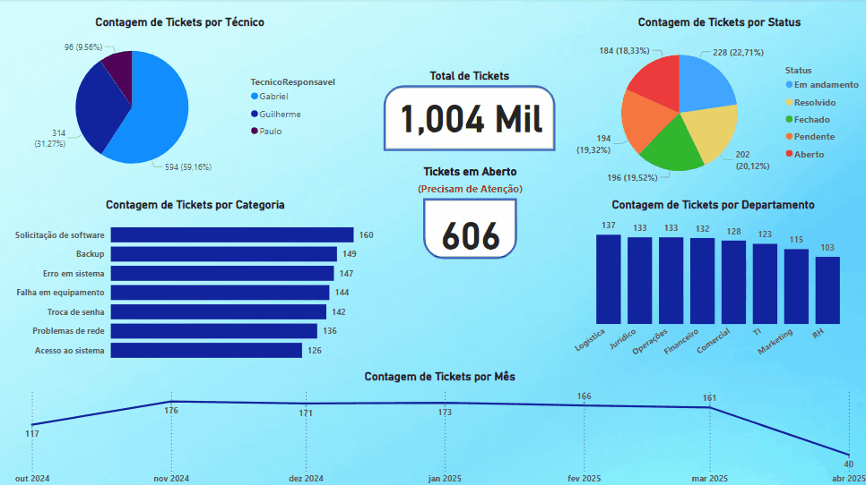

# Sistema de Helpdesk com AppSheet, Power BI e Looker Studio (Demonstração)

Este repositório documenta a criação de um sistema funcional de suporte técnico (helpdesk) como projeto de portfólio pessoal. O objetivo foi construir uma solução end-to-end, desde o registro do chamado até a análise de dados, explorando e comparando ferramentas No-Code/Low-Code (Google AppSheet) e de Business Intelligence (Microsoft Power BI, Google Looker Studio) utilizando exclusivamente recursos gratuitos (free tier).

## 💡 Motivação e Contexto

Com mais de 6 anos de experiência em suporte técnico e service desk, frequentemente me deparei com a ausência de ferramentas adequadas para registro e acompanhamento de chamados, recorrendo a planilhas precárias. Tendo tido contato prévio com a Power Platform em ambiente corporativo, surgiu a ideia de replicar e aprimorar uma solução de helpdesk utilizando ferramentas acessíveis gratuitamente, documentando todo o processo como um estudo de caso prático e item de portfólio.

## 📊 Visão Geral da Solução Implementada

Utilizando um conjunto de dados fictícios (~1000 chamados) gerado via ChatGPT e armazenado centralmente no Google Sheets, a solução integrada consiste em:

1.  **Aplicativo de Registro e Gestão (Google AppSheet):**
    *   Interface para criação e edição de chamados.
    *   Visualização de lista e detalhes dos tickets.
    *   Ações rápidas para mudança de status (`Iniciar Atendimento`, `Resolver Chamado`).
    *   Geração automática de ID numérico sequencial.
    *   Acessível via Web e Mobile.
2.  **Dashboard Analítico Interativo (Google Looker Studio):**
    *   Conectado diretamente ao **Google Sheets** como fonte de dados.
    *   **Página 1: App Incorporado:** O próprio AppSheet funcional embarcado para registro/consulta direta.
    *   **Página 2: Dashboard Principal:** KPIs (Total, Abertos), gráficos de distribuição (Status, Técnico, Categoria, Departamento) e análise temporal (Tickets por Mês).
    *   **Página 3: Tabela Detalhada:** Visão tabular completa para consulta e ordenação.
    *   **Acesso Público:** Compartilhado via link direto (ver seção de demonstração).
3.  **Dashboard Analítico Alternativo (Microsoft Power BI):**
    *   Conectado ao mesmo **Google Sheets**.
    *   Oferece uma visão similar de KPIs e gráficos, demonstrando a implementação na plataforma Microsoft.
    *   **Acesso Limitado:** Devido às restrições de publicação gratuita do Power BI para contas pessoais, a demonstração é feita via GIF (ver seção abaixo).

## 🛠️ Tecnologias Utilizadas

*   **Aplicação:** Google AppSheet (Free Plan)
*   **Base de Dados:** Google Sheets (Free Personal Account)
*   **Dashboarding Principal:** Google Looker Studio (Free)
*   **Dashboarding Alternativo:** Microsoft Power BI Desktop (Free)
*   **Geração de Dados:** ChatGPT (GPT-3.5/4)
*   **Formato Inicial de Dados:** CSV
*   **Versionamento e Documentação:** Git / GitHub

## 🎥 Demonstração Visual e Acesso

**1. Dashboard Interativo e App Integrado (Looker Studio):**

*   **[➡️ ACESSE O DASHBOARD INTERATIVO AQUI](https://lookerstudio.google.com/reporting/c340fd51-9fcb-43f5-a33f-b6fbe084a9e3/page/p_yc0rmrgerd)**
*   **Prévia (GIF):**
    

**2. Fluxo no App Individual (Google AppSheet):**

*   **Link Direto:** [Acessar AppSheet Diretamente](https://www.appsheet.com/start/1817d2fc-aa88-4a06-9089-b5bafb7664b3)
*   **Demonstração (GIFs):**
    *   Navegação e Criação (Desktop):
        

    *   Navegação e Ações (Mobile):
    *   

**3. Interação com o Dashboard Alternativo (Power BI):**

*   **(Sem link público viável para conta pessoal gratuita)**
*   **Demonstração (GIF):**
    

## 📂 Estrutura do Repositório

- **/data**: Contém os dados brutos e processados
- **/power-bi**: Implementação em Power BI com documentação
- **/looker-studio**: Implementação em Looker Studio com documentação
- **/google-appsheet**: Implementação em Google AppSheet com documentação

*(Nota: Uma pasta `/power-apps` pode existir contendo notas sobre a exploração inicial, mas não faz parte da solução final implementada).*

## 📝 Documentação Detalhada

**O processo passo-a-passo, configurações chave, fórmulas (ID sequencial, filtros), desafios e screenshots encontram-se nos READMEs específicos de cada ferramenta:**

*   **➡️ [`/google-appsheet/README.md`](/google-appsheet/README.md)**
*   **➡️ [`/google-looker-studio/README.md`](/google-looker-studio/README.md)**
*   **➡️ [`/power-bi/README.md`](/power-bi/README.md)**

## 📊 Comparação Rápida das Ferramentas (Neste Contexto)

| Ferramenta      | Prós                                                                                                | Contras                                                                                                | Ideal Para (Neste Projeto)                                                                 |
| :-------------- | :-------------------------------------------------------------------------------------------------- | :----------------------------------------------------------------------------------------------------- | :----------------------------------------------------------------------------------------- |
| **Google AppSheet** | ✓ Criação de App CRUD extremamente rápida ✓ Integração nativa com Google Sheets ✓ Lógica No-Code funcional (ID auto, actions) ✓ Plano gratuito generoso para uso básico | ✗ Opções de UI/UX limitadas (visual padrão) ✗ Lógicas muito complexas podem exigir workarounds        | Criação rápida de apps internos/simples, prototipagem, CRUDs baseados em planilhas.        |
| **Google Looker Studio** | ✓ Interface intuitiva ✓ Conexão fácil com Google Sheets ✓ **Compartilhamento público/link fácil e gratuito** ✓ Boa variedade de gráficos ✓ **Permite incorporar URLs (AppSheet!)** | ✗ Menos poder em ETL/modelagem de dados vs Power Query ✗ DAX inexistente (cálculos mais simples)  | Dashboards rápidos, visualização de dados do ecossistema Google, compartilhamento fácil. |
| **Microsoft Power BI** | ✓ Power Query robusto para ETL ✓ DAX para cálculos complexos ✓ Vasta gama de visuais e customização ✓ Padrão em muitas empresas (skill valorizada) | ✗ **Restrições SEVERAS no compartilhamento gratuito para contas pessoais** ✗ Curva de aprendizado maior para DAX/PQ | Análises complexas, modelagem de dados avançada, ambientes corporativos Microsoft.        |

## 🔄 Processo de Desenvolvimento (Resumo da Jornada Real)

1.  **Idealização & Dados:** Definição do escopo baseado em experiência prévia e geração de dados fictícios (CSV) via ChatGPT.
2.  **Base de Dados:** Configuração do Google Sheets como repositório central.
3.  **Obstáculo Inicial:** Tentativa de uso do Power Apps barrada por limitações de conta/licença gratuita. **Decisão de pivotar.**
4.  **App Development (AppSheet):** Criação rápida e configuração do aplicativo CRUD funcional.
5.  **Dashboarding v1 (Power BI):** Conexão ao Sheets, criação de visuais e KPIs. Constatação da dificuldade de compartilhamento gratuito.
6.  **Dashboarding v2 & Integração (Looker Studio):** Conexão ao Sheets, replicação/melhoria dos visuais, criação das 3 páginas (App embedado, Dashboard, Tabela). Configuração do compartilhamento público via link.
7.  **Demonstração:** Criação de GIFs para Power BI e AppSheet; obtenção do link público para Looker Studio.
8.  **Documentação:** Estruturação do repositório e detalhamento dos READMEs (em andamento).

## 📚 Aprendizados e Reflexões

*   **Licenciamento Free Tier é Crucial:** A experiência com Power Apps foi um lembrete duro: sempre valide as limitações *reais* (especialmente de compartilhamento e conectores) dos planos gratuitos antes de investir tempo.
*   **Ecossistema Google para Prototipagem Rápida:** A combinação Sheets + AppSheet + Looker Studio oferece um caminho de baixíssimo atrito e custo zero para criar e compartilhar soluções de dados funcionais rapidamente.
*   **Looker Studio Surpreende:** Apesar de talvez menos "poderoso" em ETL/cálculos que o Power BI, sua facilidade de uso, integração com o G-Suite e, principalmente, o **compartilhamento descomplicado** o tornam uma excelente opção para projetos pessoais e portfólios. A capacidade de incorporar URLs é um bônus inesperado e útil.
*   **Power BI: Potencial x Acesso:** Continua sendo uma ferramenta incrível, especialmente com Power Query e DAX, mas suas barreiras de compartilhamento no nível gratuito o tornam menos ideal para demonstrações públicas individuais.
*   **Adaptabilidade > Plano Original:** Ser capaz de mudar de rota (Power Apps -> AppSheet/Looker) e ainda entregar um resultado robusto (até melhorado, com o app embedado) é uma habilidade essencial.

## 📞 Contato

**Gabriel Arten Conde**
*   **LinkedIn:** https://www.linkedin.com/in/gabriel-arten-conde/
*   **Email:** gabriel_x5@hotmail.com
