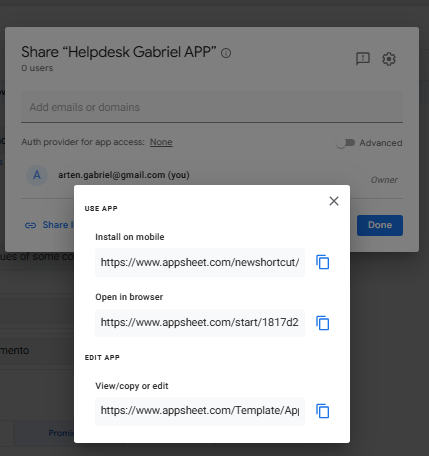
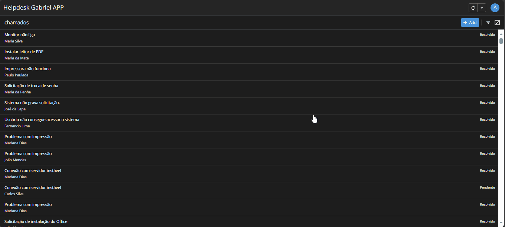

# Documentação: Implementação com Google AppSheet

Este documento detalha o processo de criação do aplicativo de registro e gerenciamento de chamados de helpdesk utilizando a plataforma Google AppSheet.

## Sumário

1.  [Configuração Inicial e Conexão de Dados](#1-configuração-inicial-e-conexão-de-dados)
2.  [Configuração da Tabela (Colunas e Tipos)](#2-configuração-da-tabela-colunas-e-tipos)
3.  [Lógica de Negócio e Automação (Valores Iniciais e ID Automático)](#3-lógica-de-negócio-e-automação-valores-iniciais-e-id-automático)
4.  [Interface do Usuário (Views: Lista, Formulário, Detalhes)](#4-interface-do-usuário-views-lista-formulário-detalhes)
5.  [Ações Rápidas (Behavior: Mudança de Status)](#5-ações-rápidas-behavior-mudança-de-status)
6.  [Desafios e Soluções](#6-desafios-e-soluções)
7.  [Publicação e Compartilhamento](#7-publicação-e-compartilhamento)
8.  [Limitações da Versão Gratuita](#8-limitações-da-versão-gratuita)
9.  [Screenshots Relevantes](#9-screenshots-relevantes)

---

## 1. Configuração Inicial e Conexão de Dados

O processo começou acessando [appsheet.com](https://www.appsheet.com/) e fazendo login com a conta Google pessoal (gratuita).

1.  **Criação do App:** Iniciou-se um novo aplicativo ("Create" -> "App" -> "Start with existing data").
2.  **Seleção da Fonte de Dados:** Foi selecionado o conector **Google Sheets**.
3.  **Autorização:** Concedida a permissão necessária para o AppSheet acessar as planilhas Google do usuário.
4.  **Seleção da Planilha:** A planilha `chamados_helpdesk`, contendo os dados fictícios previamente importados do CSV, foi selecionada. A aba `Chamados` foi escolhida como a tabela principal.
5.  **Geração Automática:** O AppSheet analisou a estrutura da planilha e gerou automaticamente as visualizações (Views) iniciais (Lista, Detalhes, Formulário) e tentou inferir os tipos de dados das colunas.


**Novo Aplicativo**  
     


**Selecionando Tipo de Fonte de Dados**  
     


**Selecionando a Planilha de Fonte de Dados**  
     


**Geração Automática do Protótipo Baseado na Planilha**  
     


## 2. Configuração da Tabela (Colunas e Tipos)

Após a conexão inicial, foi crucial revisar e ajustar as configurações das colunas na seção `Data` -> `Tables` -> `Chamados` -> `Columns`:

*   **Tipos de Dados:** Verificou-se se os tipos inferidos estavam corretos (ex: `IDChamado` como `Number`, `DataAbertura`/`DataFechamento` como `DateTime`, `Status`/`Urgencia`/`Categoria` como `Enum` para permitir dropdowns, outros como `Text`). Ajustes foram feitos manualmente onde necessário.
*   **Propriedades Chave:**
    *   `SHOW?`: Desmarcado para colunas irrelevantes para o usuário final.
    *   `EDITABLE?`: Desmarcado para colunas que não deveriam ser editadas manualmente (ex: `IDChamado`, `DataAbertura` após ajuste do valor inicial).
    *   `REQUIRE?`: Marcado para campos obrigatórios no formulário de criação.  


**Tela de configuração das colunas (`Data` -> `Columns`) mostrando tipos e propriedades após ajustes**  
  


## 3. Lógica de Negócio e Automação (Valores Iniciais e ID Automático)

Para automatizar partes do processo, foram configurados valores iniciais (`INITIAL VALUE`) na seção `Auto Compute` de algumas colunas:

*   **`DataAbertura`:**
    *   Fórmula: `NOW()`
    *   Objetivo: Preencher automaticamente com a data e hora atuais ao abrir um novo chamado.
*   **`IDChamado` (Numérico Sequencial):**
    *   **Desafio:** Gerar um ID único e sequencial (1001, 1002...) após os 1000 registros iniciais. Tentativas iniciais com formatação de texto falharam devido a peculiaridades das funções AppSheet.
    *   **Solução Final:**
        1.  Limpeza da coluna `IDChamado` no Google Sheets para conter apenas números.
        2.  Regeneração da estrutura da tabela no AppSheet para reconhecer `IDChamado` como `Number`.
        3.  Utilização da fórmula simples no `INITIAL VALUE` de `IDChamado`:
            ```appsheet
            (MAX(Chamados[IDChamado]) + 1)
            ```
    *   **Configurações Adicionais:** `EDITABLE?` foi desmarcado para `IDChamado` para evitar edição manual.

**Tela de configuração do `INITIAL VALUE` para `DataAbertura`**
  

**Tela de configuração do `INITIAL VALUE` para `IDChamado`**
  


## 4. Interface do Usuário (Views: Lista, Formulário, Detalhes)

As visualizações (Views) geradas automaticamente foram ajustadas na seção `UX` -> `Views`:

*   **Visão Principal (Lista):**
    *   **Tipo:** Alterado para `Deck` para melhor visualização mobile/resumida.
    *   **Configuração:** `Primary header` (`DescricaoCurta`), `Secondary header` (`Solicitante`), `Summary column` (`Status`).
    *   **Ordenação (`Sort by`):** Definido para ordenar por `DataAbertura` (Decrescente).
    
*   **Visão de Formulário (`Chamados_Form`):**
    *   **`Column order`:** Ajustada para apresentar os campos em ordem lógica de preenchimento. Campos não editáveis na criação (como `IDChamado`, `DataFechamento`) foram removidos desta View.
*   **Visão de Detalhes (`Chamados_Detail`):**
    *   **`Column order`:** Organizada para mostrar todas as informações relevantes do chamado selecionado.
 
       
**Tela de configuração das Views do sistema**


## 5. Ações Rápidas (Behavior: Mudança de Status)

Para agilizar a atualização de status, foram criadas Ações na seção `Behavior` -> `Actions`:

1.  **Ação `Iniciar Atendimento`:**
    *   **`Do this`:** `Data: set the values of some columns in this row`
    *   **`Set these columns`:** `Status` = `"Em Andamento"`
    *   **`Prominence`:** `Display prominently`
    *   **`Behavior (Condition)`:** `[Status] = "Aberto"` (Só aparece para chamados abertos)
    *   **`Appearance`:** Ícone de "Lampada".
2.  **Ação `Resolver Chamado`:**
    *   **`Do this`:** `Data: set the values of some columns in this row`
    *   **`Set these columns`:** `Status` = `"Resolvido"`, `DataFechamento` = `NOW()`
    *   **`Prominence`:** `Display prominently`
    *   **`Behavior (Condition)`:** `AND( [Status] <> "Resolvido", [Status] <> "Fechado" )` (Não aparece para chamados já finalizados)
    *   **`Appearance`:** Ícone de "check".

Estas ações aparecem como botões na visão de detalhes (e/ou como ícones na lista), permitindo atualizar o chamado com um clique.  

**Tela de configuração das Actions do sistema**
  


## 6. Desafios e Soluções

| Desafio                                    | Solução                                                                                                                                                               |
| :----------------------------------------- | :-------------------------------------------------------------------------------------------------------------------------------------------------------------------- |
| Geração de ID Sequencial com prefixo ("HD-") | Tentativas com fórmulas `TEXT()` e `IFS()` falharam devido a limitações/interpretações das funções AppSheet. **Solução:** Simplificar! Remover prefixo no Google Sheets, tratar ID como `Number` e usar fórmula `MAX(...) + 1`. |
| Garantir Tipos de Dados Corretos          | AppSheet nem sempre infere o tipo correto (especialmente Datas/Enums). **Solução:** Revisão manual e ajuste dos tipos na seção `Data` -> `Columns` após importação/regeneração. |
| UI/UX Limitada                             | A aparência visual padrão do AppSheet é funcional, mas pouco customizável no plano gratuito. **Solução:** Aceitar as limitações e focar na funcionalidade e organização das Views. |

## 7. Publicação e Compartilhamento

*   O AppSheet salva automaticamente as alterações.
*   O aplicativo pode ser compartilhado através de links gerados na seção `Users` ou `Share` (dependendo da versão da interface).
*   Foi utilizado o **Browser Link** para acesso direto.
*   **Importante:** No plano gratuito, o número de usuários "ativos" do app pode ser limitado (geralmente o criador + poucos usuários de teste). Para um portfólio, o link direto é funcional para demonstração individual.  

**Tela de compartilhamento do sistema**  
  


## 8. Limitações da Versão Gratuita

*   **Número de Usuários:** Limitado (geralmente <10 usuários ativos, incluindo o dono).
*   **Recursos Avançados:** Funcionalidades como automações complexas (bots), segurança granular (Security Filters mais avançados), e algumas integrações podem ser restritas.
*   **Offline:** Capacidades offline podem ser limitadas ou exigir configuração adicional.
*   **Branding:** Pode exibir a marca do AppSheet em alguns locais.
*   **Performance:** Apps muito complexos ou com muitos dados podem ter performance reduzida.

*(Para este projeto de demonstração, o plano gratuito foi perfeitamente adequado.)*

## 9. Screenshots Relevantes  

**Demonstração do Fluxo Completo no App**  

