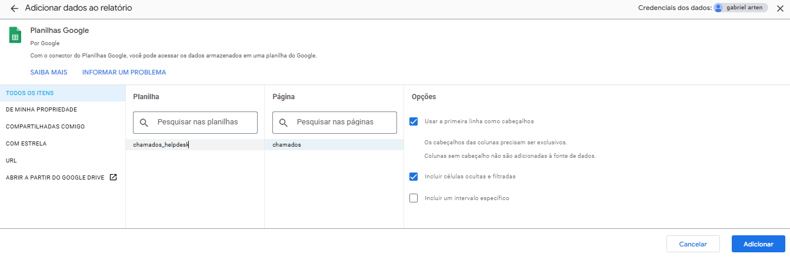
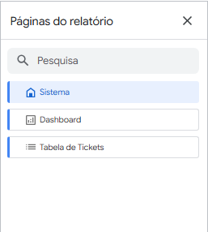
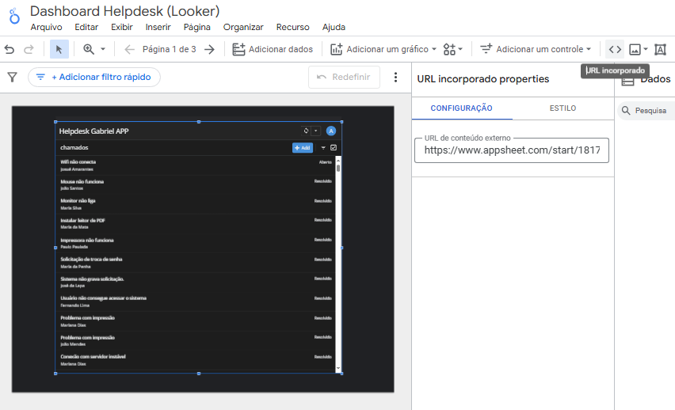
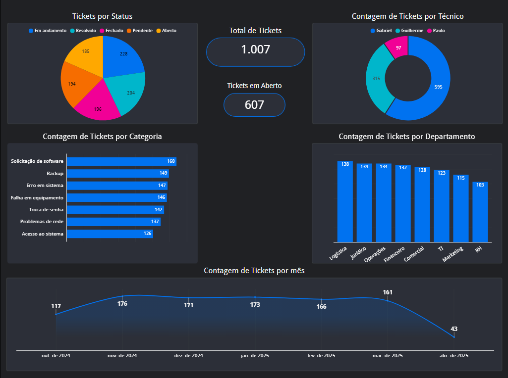
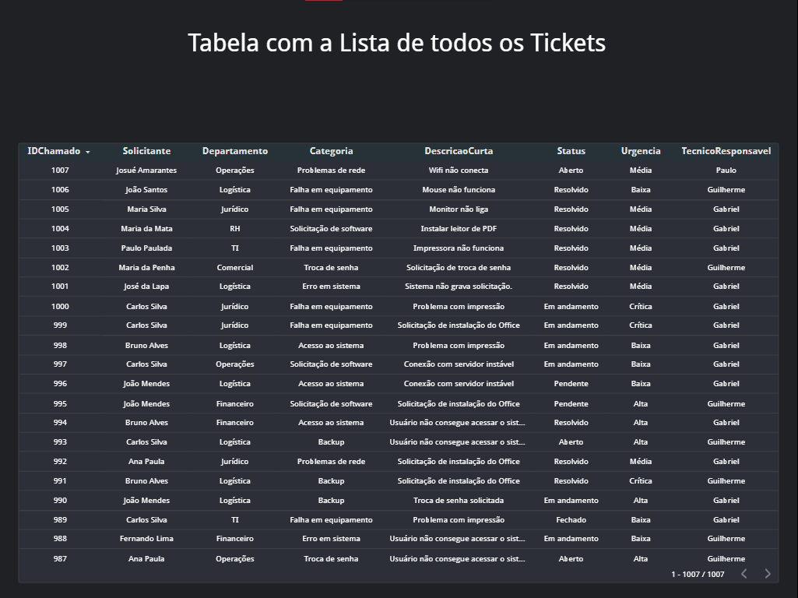
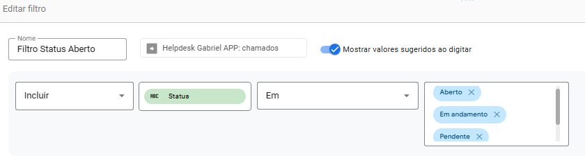
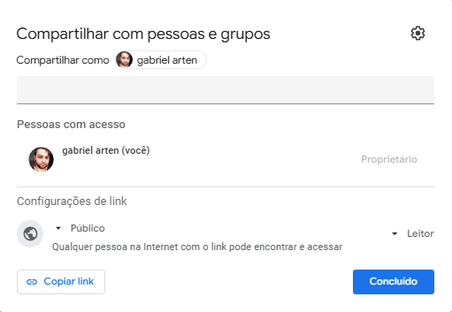
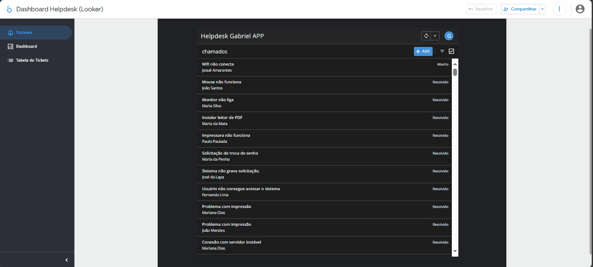

# Documentação: Implementação com Google Looker Studio

Este documento detalha o processo de criação do dashboard analítico interativo para o sistema de helpdesk, utilizando a plataforma Google Looker Studio (anteriormente Google Data Studio).

## Sumário

1.  [Configuração Inicial e Conexão de Dados](#1-configuração-inicial-e-conexão-de-dados)
2.  [Estrutura Multi-Páginas](#2-estrutura-multi-páginas)
3.  [Página 1: Incorporação do AppSheet](#3-página-1-incorporação-do-appsheet)
4.  [Página 2: Construção do Dashboard Principal (Gráficos e KPIs)](#4-página-2-construção-do-dashboard-principal-gráficos-e-kpis)
5.  [Página 3: Tabela Detalhada de Chamados](#5-página-3-tabela-detalhada-de-chamados)
6.  [Configuração de Filtros (Ex: KPI "Tickets em Aberto")](#6-configuração-de-filtros-ex-kpi-tickets-em-aberto)
7.  [Estilo e Layout](#7-estilo-e-layout)
8.  [Desafios e Soluções](#8-desafios-e-soluções)
9.  [Publicação e Compartilhamento (Link Público)](#9-publicação-e-compartilhamento-link-público)
10. [Limitações da Versão Gratuita](#10-limitações-da-versão-gratuita)
11. [Screenshots Relevantes](#11-screenshots-relevantes)

---

## 1. Configuração Inicial e Conexão de Dados

1.  **Acesso:** O processo iniciou acessando [lookerstudio.google.com](https://lookerstudio.google.com/) com a mesma conta Google utilizada para o AppSheet e Google Sheets.
2.  **Novo Relatório:** Um novo relatório em branco foi criado (`+ Criar` -> `Relatório`).
3.  **Fonte de Dados:** O conector **`Planilhas Google`** foi selecionado.
4.  **Autorização:** Permissão foi concedida para o Looker Studio acessar os dados do Google Sheets.
5.  **Seleção:** A planilha `chamados_helpdesk` e a aba `Chamados` foram selecionadas como fonte de dados principal. As opções "Usar primeira linha como cabeçalho" foram mantidas.
6.  **Adição:** A fonte de dados foi adicionada ao relatório.  

Tela Inicial - `+ Criar` -> `Relatório`.  
  

Tela de seleção da fonte de dados Google Sheets no Looker Studio.  
  

## 2. Estrutura Multi-Páginas

Para organizar o conteúdo e integrar o AppSheet, uma estrutura de múltiplas páginas foi adotada:

*   **Criação:** Novas páginas foram adicionadas clicando na aba `Página` -> `Nova página` no menu superior.
*   **Renomeação:** Cada página foi renomeada para refletir seu conteúdo (ex: "Sistema", "Dashboard", "Tabela de Tickets") clicando no nome da página.  

Menu Superior - Aba `Página` -> `Nova página`.  
  
  
  
Gerenciador de páginas mostrando as 3 páginas criadas.  
  

## 3. Página 1: Incorporação do AppSheet

O diferencial desta implementação foi incorporar o próprio aplicativo AppSheet funcional dentro do relatório Looker Studio:

1.  **Componente:** Na primeira página ("Sistema"), foi utilizado o componente `URL incorporado` (URL embed), acessível pelo menu superior.
2.  **Configuração:** No campo `URL externa` (External URL) do componente, foi colado o **link de acesso via navegador (Browser Link)** do aplicativo AppSheet previamente criado.
    *   Link utilizado: `https://www.appsheet.com/start/1817d2fc-aa88-4a06-9089-b5bafb7664b3`
3.  **Resultado:** Permite que usuários visualizem e interajam com o aplicativo AppSheet (registrar, editar chamados) diretamente dentro do ambiente do Looker Studio.  

Configuração do componente 'Incorporar URL' com o link do AppSheet.  
  

## 4. Página 2: Construção do Dashboard Principal (Gráficos e KPIs)

A segunda página ("Dashboard") concentra as análises visuais principais, replicando e adaptando o que foi feito no Power BI:

*   **Gráficos Adicionados:** Utilizando o menu `Adicionar um gráfico`, foram incluídos:
    *   **Pizza (Tickets por Status):** `Dimensão`: `Status`, `Métrica`: `Contagem distinta` de `IDChamado`.
    *   **Rosca (Tickets por Técnico):** `Dimensão`: `TecnicoResponsavel`, `Métrica`: `Contagem distinta` de `IDChamado`.
    *   **Barras (Tickets por Categoria):** `Dimensão`: `Categoria`, `Métrica`: `Contagem distinta` de `IDChamado`.
    *   **Colunas (Tickets por Departamento):** `Dimensão`: `Departamento`, `Métrica`: `Contagem distinta` de `IDChamado`.
    *   **Gráfico de Linhas (Tickets por Mês/Ano):** `Dimensão`: `DataAbertura` (agrupado por Ano/Mês), `Métrica`: `Contagem distinta` de `IDChamado`.
*   **KPIs (Placares):** Utilizando o gráfico `Visão Geral` (Scorecard/Placar):
    *   **Total de Tickets:** `Métrica`: `Contagem distinta` de `IDChamado`.
    *   **Tickets em Aberto:** `Métrica`: `Contagem distinta` de `IDChamado`. **Filtro aplicado** (ver seção 6).  

Visão geral da página "Dashboard" com os gráficos e KPIs configurados.  
  

## 5. Página 3: Tabela Detalhada de Chamados

Para permitir consulta aos dados brutos, a terceira página ("Tabela de Tickets") contém:

*   **Componente:** Um gráfico do tipo **`Tabela` (Table)** foi adicionado (`Adicionar um gráfico` -> `Tabela`).
*   **Configuração:**
    *   **`Dimensão`:** Foram adicionadas todas as colunas relevantes para visualização (`IDChamado`, `DataAbertura`, `Solicitante`, `Status`, `DescricaoCurta`, etc.).
    *   **`Métrica`:** Nenhuma métrica agregada é necessária aqui, apenas as dimensões.
    *   **`Linhas por página`:** Ajustado para mostrar todas as linhas.
    *   **`Classificação`:** Permitido ao usuário ordenar clicando nos cabeçalhos ou definido um padrão (ex: `IDChamado` decrescente).  

Visão da página "Tabela de Tickets" mostrando a tabela configurada.  
  

## 6. Configuração de Filtros (Ex: KPI "Tickets em Aberto")

O KPI "Tickets em Aberto" exigiu um filtro específico para contar apenas os chamados não finalizados:

1.  **Seleção:** O gráfico `Visão Geral` correspondente foi selecionado.
2.  **Adição de Filtro:** No painel `Gráfico` -> `Filtro`, clicou-se em `+ Adicionar um filtro`.
3.  **Configuração do Filtro (`Filtro Status Aberto`):**
    *   `Incluir`
    *   Campo: `Status`
    *   Condição: `Está em (lista)` (In)
    *   Valores: `"Aberto"`, `"Em Andamento"`, `"Pendente"`.
4.  **Aplicação:** O filtro foi salvo e aplicado exclusivamente a este placar.  

Janela de configuração do filtro "Filtro Status Aberto".  
  

## 7. Estilo e Layout

*   Um **tema escuro** pré-definido foi aplicado através do painel `Tema e layout` para dar uma aparência consistente ao relatório.
*   Títulos foram adicionados aos gráficos utilizando as opções de formatação de cada gráfico na aba `Estilo`.
*   Os elementos foram redimensionados e posicionados para criar um layout organizado em cada página.  

## 8. Desafios e Soluções

| Desafio                                      | Solução                                                                                                                                |
| :------------------------------------------- | :------------------------------------------------------------------------------------------------------------------------------------- |
| Incorporar AppSheet funcionalmente          | Identificar e utilizar o componente `Incorporar URL` corretamente, utilizando o link "Browser Link" do AppSheet.                        |
| Criar KPI Filtrado ("Tickets em Aberto")    | Entender a aplicação de filtros específicos a um único gráfico (Placar) em vez de filtros de relatório/página. Configurar a condição `In`. |
| Organização Multi-Páginas                    | Planejar o conteúdo de cada página e usar o gerenciador de páginas para navegação clara.                                                 |
| (Menor) Entender Dimensão vs. Métrica       | Compreender que "Dimensão" é o que categoriza/agrupa (texto, data) e "Métrica" é o que é medido/contado (número, contagem).              |

## 9. Publicação e Compartilhamento (Link Público)

O compartilhamento do relatório Looker Studio foi configurado para acesso público (somente visualização):

1.  Botão `Compartilhar` -> `Gerenciar acesso`.
2.  Opção alterada para **`Qualquer pessoa com o link pode ver`**.
3.  O link gerado foi copiado para uso externo (README principal).
4.  **Vantagem:** Este método permite visualização interativa do dashboard por qualquer pessoa com o link, sem exigir login e sem as restrições severas do Power BI gratuito.  

Janela de configuração de compartilhamento do Looker Studio.  
  

## 10. Limitações da Versão Gratuita

*   **Recursos Avançados:** Funções de modelagem de dados mais complexas (comparáveis ao Power Query avançado/DAX) são limitadas.
*   **Blending de Dados:** Pode haver limitações no número de fontes que podem ser combinadas.
*   **Performance:** Relatórios extremamente complexos com múltiplas fontes e milhões de linhas podem apresentar lentidão (não aplicável a este projeto).

*(Para a escala e complexidade deste projeto, o Looker Studio gratuito foi mais do que suficiente e ofereceu vantagens significativas no compartilhamento.)*

## 11. Screenshots Relevantes  

Demonstração do Dashboard e suas funcionalidades  
  

