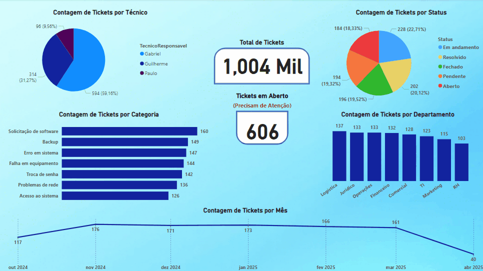

# Documentação: Implementação com Microsoft Power BI

Este documento detalha o processo de criação da versão do dashboard analítico do helpdesk utilizando **Microsoft Power BI Desktop**. O objetivo era comparar a implementação e visualização dos mesmos dados em relação ao Google Looker Studio.

**Nota Importante sobre Compartilhamento:** Devido às limitações de publicação/compartilhamento gratuito do Power BI Service para contas pessoais, **não há um link interativo** para este dashboard. A demonstração principal é feita através de um **GIF animado** (referenciado no [README principal do projeto](../../README.md) e na subpasta `/screenshots/`).

## Sumário

1.  [Configuração Inicial e Conexão de Dados](#1-configuração-inicial-e-conexão-de-dados)
2.  [Transformação de Dados (Power Query - Opcional)](#2-transformação-de-dados-power-query---opcional)
3.  [Criação dos Visuais (Gráficos e KPIs)](#3-criação-dos-visuais-gráficos-e-kpis)
4.  [Configuração de Filtros (Ex: KPI "Tickets em Aberto")](#4-configuração-de-filtros-ex-kpi-tickets-em-aberto)
5.  [Estilo e Layout](#5-estilo-e-layout)
6.  [Desafios e Soluções](#6-desafios-e-soluções)
7.  [Arquivo .pbix](#7-arquivo-pbix)
8.  [Screenshots Relevantes](#8-screenshots-relevantes)

---

## 1. Configuração Inicial e Conexão de Dados

1.  **Ferramenta:** Foi utilizado o **Power BI Desktop**, instalado gratuitamente no Windows.
2.  **Obter Dados:** A conexão foi iniciada através da opção `Página Inicial` -> `Obter Dados`.
3.  **Conector:** O conector **`Google Sheets`** foi selecionado.
4.  **Autenticação:** Não foi necessário autenticar com a conta Google, pois a planilha está em modo publico. (Qualquer pessoa com o link pode acessar, aplicavel em nosso projeto).
5.  **Seleção:** Ao selecionar o conector, abriu uma tela para inserir a URL da planilha no sheets, copiamos o endereço da planilha `chamados_helpdesk` e a aba `Chamados` com os dados foram selecionados.  
    URL publica utilizada: `https://docs.google.com/spreadsheets/d/1595-l2xxGgJjU66AKt2VmworNGLN3SCawOoVgObuk-Q/edit?usp=sharing`
7.  **Carregamento:** Os dados foram carregados no modelo do Power BI, passando brevemente pelo Power Query Editor (`Transformar Dados`) para verificação inicial.

Tela "Obter Dados" mostrando o conector Google Sheets  
  

Janela do Navegador selecionando a planilha  
  

## 2. Transformação de Dados (Power Query - Opcional)

*   Ao clicar em `Transformar Dados`, o Power Query Editor foi aberto.
*   Uma verificação rápida foi feita para garantir que os cabeçalhos foram promovidos corretamente e que os tipos de dados básicos (número, texto, data/hora) foram inferidos de forma adequada pelo Power Query.
*   Nenhuma transformação complexa (ETL) foi necessária para este conjunto de dados específico, então clicou-se em `Fechar e Aplicar`.  

Janela do Power Query Editor mostrando os dados carregados e os tipos inferidos.  
  

## 3. Criação dos Visuais (Gráficos e KPIs)

Com os dados carregados no modelo, os seguintes visuais foram criados no painel `Visualizações`:

*   **Gráficos:**
    *   **Rosca (Tickets por Status):** `Legenda`: `Status`, `Valores`: `Contagem distinta` de `IDChamado`.
    *   **Barras Agrupadas (Tickets por Técnico):** `Eixo Y`: `TecnicoResponsavel`, `Eixo X`: `Contagem distinta` de `IDChamado`.
    *   **Barras Agrupadas (Tickets por Categoria):** `Eixo Y`: `Categoria`, `Eixo X`: `Contagem distinta` de `IDChamado`.
    *   **Colunas Agrupadas (Tickets por Departamento):** `Eixo X`: `Departamento`, `Eixo Y`: `Contagem distinta` de `IDChamado`.
    *   **Gráfico de Linha (Tickets por Mês/Ano):** `Eixo X`: `DataAbertura` (utilizando hierarquia ou eixo contínuo), `Eixo Y`: `Contagem distinta` de `IDChamado`.
*   **KPIs (Cartão):** Utilizando o visual `Cartão` (Card):
    *   **Total de Tickets:** `Campos`: `Contagem distinta` de `IDChamado`.
    *   **Tickets em Aberto:** `Campos`: `Contagem distinta` de `IDChamado`. **Filtro aplicado** (ver seção 4).  

Configuração de um dos gráficos de pizza.  
  

Configuração do grafico de linha.  
  

## 4. Configuração de Filtros (Ex: KPI "Tickets em Aberto")

Para o KPI "Tickets em Aberto", foi aplicado um filtro diretamente no visual:

1.  **Seleção:** O visual `Cartão` correspondente foi selecionado.
2.  **Painel de Filtros:** O campo `Status` foi arrastado para a área "Filtros neste visual".
3.  **Configuração:** O tipo de filtro foi definido como `Filtragem básica`. As caixas de seleção correspondentes aos status considerados "abertos" (`Aberto`, `Em Andamento`, `Pendente`, etc. - *Ajuste conforme seus status*) foram **marcadas**. Os status finais (`Resolvido`, `Fechado`) foram deixados desmarcados.
4.  **Aplicação:** O filtro restringiu a contagem do cartão apenas aos chamados não finalizados.

Painel de Filtros mostrando o filtro de Status aplicado ao visual Cartão.  
  

## 5. Estilo e Layout

*   Foi aplicado um **tema escuro** através da aba `Exibição` -> `Temas`.
*   Os **títulos** dos visuais foram editados para clareza (`Formatar visual` -> `Geral` -> `Título`).
*   Rótulos de dados, cores e eixos foram ajustados minimamente através das opções de formatação (`Formatar visual`) para melhorar a legibilidade.
*   Os visuais foram redimensionados e alinhados na página para criar um layout coeso.

## 6. Desafios e Soluções

| Desafio                                                           | Solução                                                                                                                                                                                             |
| :---------------------------------------------------------------- | :-------------------------------------------------------------------------------------------------------------------------------------------------------------------------------------------------- |
| **Compartilhamento Gratuito Limitado** (Principal Desafio)        | Tentativa de `Publicar` no Power BI Service e usar `Publicar na Web (público)` foi **bloqueada** para a conta pessoal utilizada. **Solução:** Documentar a limitação e utilizar um **GIF animado** como principal meio de demonstração da interatividade do dashboard. |
| Autenticação Google Sheets: método de URL pública                   | Utilizar a URL pública compartilhada da planilha Google Sheets evitou a necessidade de autenticar a conta Google dentro do Power BI.                                                                            |
| Agregação Padrão de Valores (Soma em vez de Contagem)             | O Power BI frequentemente assume "Soma" para campos numéricos. **Solução:** Mudar manualmente a agregação para `Contagem` ou `Contagem (Distinta)` nos campos de valor dos gráficos e KPIs.            |
| Formatação Automática de KPIs (Ex: "Mil")                         | O Power BI pode abreviar números grandes. **Solução:** Ajustar a opção "Exibir unidades" para `Nenhum` nas configurações de formatação do Rótulo de dados do visual `Cartão` se a abreviação for indesejada. |

## 7. Arquivo .pbix

O arquivo fonte do Power BI Desktop (`.pbix`) contendo o relatório, modelo de dados e configurações está disponível na subpasta `/pbix/`. Isso permite que alguém com o Power BI Desktop instalado possa abrir e explorar o relatório localmente.

*   **Arquivo:** `Dashboard_Helpdesk.pbix`
*   **Localização:** [`/power-bi/pbix/`](./pbix/)

## 8. Screenshots Relevantes

Demonstração do Dashboard completo
  

